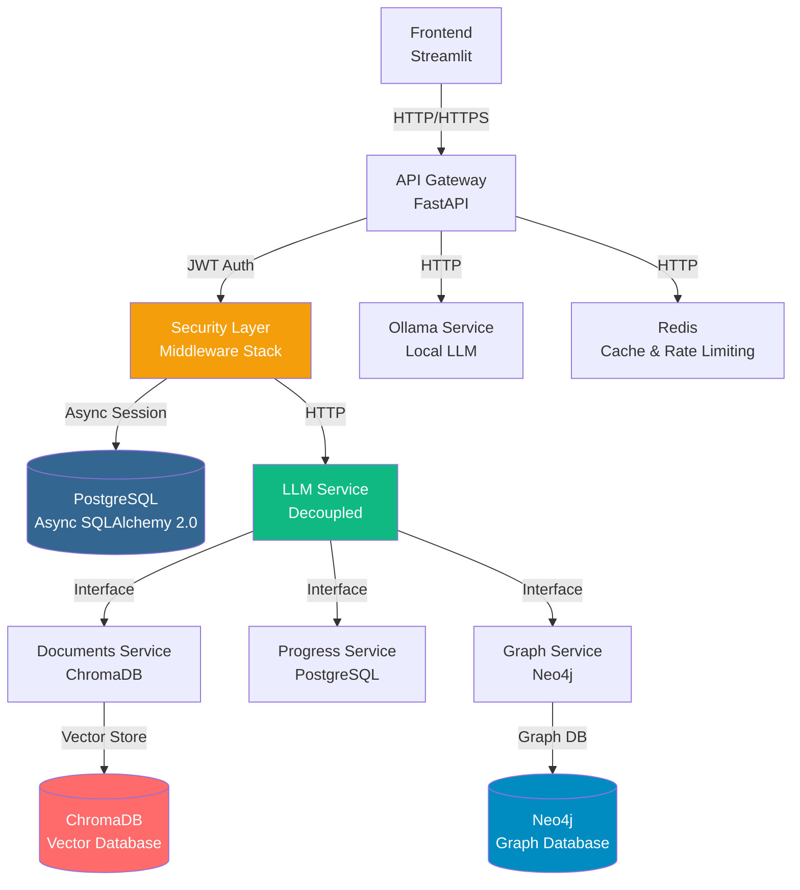
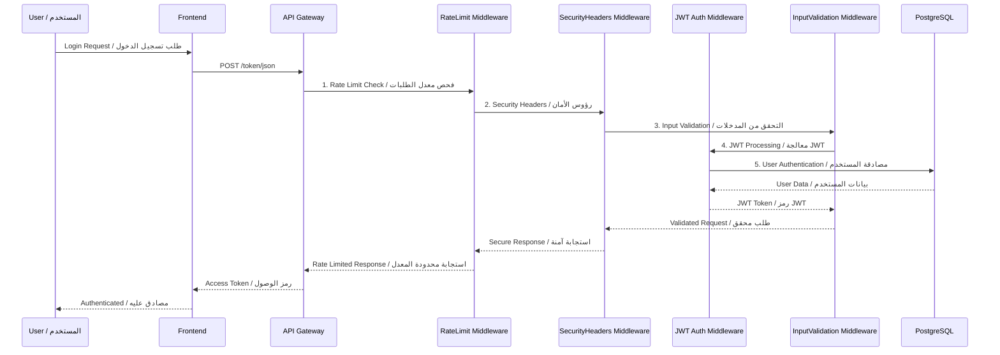
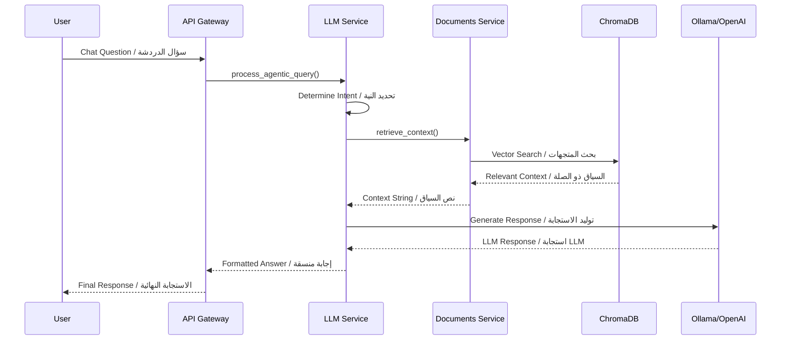

# System Architecture / هندسة النظام

> **Elite CTO Mode** - Production-ready microservices architecture with async PostgreSQL, decoupled services, and comprehensive security.

> **وضع CTO المتقدم** - هندسة microservices جاهزة للإنتاج مع PostgreSQL غير المتزامن وخدمات منفصلة وأمان شامل.

---

## 📊 System Overview / نظرة عامة على النظام



---

## 🔐 Authentication Flow / تدفق المصادقة



---

## 🏗️ Service Architecture / هندسة الخدمات

### Core Services / الخدمات الأساسية

#### 1. API Gateway (FastAPI)
- **Role / الدور**: Entry point, routing, authentication
- **Technology / التقنية**: FastAPI, Async Python
- **Database / قاعدة البيانات**: PostgreSQL (async)

#### 2. LLM Service (Decoupled)
- **Role / الدور**: Intent detection, response generation
- **Technology / التقنية**: OpenAI API / Ollama
- **Decoupling / الفصل**: Uses ServiceAdapter interface, no direct DB access

#### 3. Documents Service
- **Role / الدور**: Document ingestion, RAG retrieval
- **Technology / التقنية**: ChromaDB, LangChain
- **Storage / التخزين**: Vector embeddings in ChromaDB

#### 4. Progress Service
- **Role / الدور**: Student academic progress tracking
- **Technology / التقنية**: PostgreSQL, SQLAlchemy 2.0 (async)
- **Storage / التخزين**: Student records, grades, GPA calculations

#### 5. Graph Service
- **Role / الدور**: Course relationships, skills mapping
- **Technology / التقنية**: Neo4j
- **Storage / التخزين**: Graph database for course prerequisites

---

## 🔒 Security Architecture / هندسة الأمان

### Middleware Stack Order / ترتيب طبقات Middleware

```
Request Flow / تدفق الطلب:
1. RateLimitMiddleware      → Prevents DDoS / منع DDoS
2. RequestSizeMiddleware    → Limits payload size / تحديد حجم البيانات
3. WAFMiddleware            → Web Application Firewall / جدار حماية التطبيق
4. InputSanitizationMiddleware → Sanitizes inputs / تنظيف المدخلات
5. JWTAuthMiddleware        → JWT authentication / مصادقة JWT
6. SecurityHeadersMiddleware → Security headers / رؤوس الأمان
7. AuditLoggingMiddleware   → Request logging / تسجيل الطلبات
8. CORSMiddleware           → CORS handling / معالجة CORS
```

### Database Security / أمان قاعدة البيانات

- ✅ **Async PostgreSQL** - Production-ready database
- ✅ **SQLite Forbidden** - Strictly prohibited
- ✅ **Connection Pooling** - Efficient resource management
- ✅ **Prepared Statements** - SQL injection prevention

---

## 📦 Data Flow / تدفق البيانات

### RAG Query Flow / تدفق استعلام RAG



---

## 🗄️ Database Schema / مخطط قاعدة البيانات

### PostgreSQL Tables / جداول PostgreSQL

```sql
-- Users Table / جدول المستخدمين
users (
    id SERIAL PRIMARY KEY,
    user_id VARCHAR UNIQUE,
    full_name VARCHAR,
    hashed_password VARCHAR,
    role VARCHAR DEFAULT 'student',
    email VARCHAR UNIQUE,
    university_password VARCHAR,
    created_at TIMESTAMP,
    last_data_sync TIMESTAMP
)

-- Progress Records / سجلات التقدم
progress_records (
    id SERIAL PRIMARY KEY,
    user_id VARCHAR REFERENCES users(user_id),
    course_code VARCHAR,
    grade VARCHAR,
    hours INTEGER,
    semester VARCHAR,
    course_name VARCHAR,
    created_at TIMESTAMP,
    updated_at TIMESTAMP
)

-- Chat Messages / رسائل الدردشة
chat_messages (
    id SERIAL PRIMARY KEY,
    user_id VARCHAR REFERENCES users(user_id),
    role VARCHAR,
    content TEXT,
    intent VARCHAR,
    created_at TIMESTAMP
)

-- Notifications / الإشعارات
notifications (
    id SERIAL PRIMARY KEY,
    user_id VARCHAR REFERENCES users(user_id),
    message VARCHAR,
    type VARCHAR,
    is_read BOOLEAN DEFAULT FALSE,
    created_at TIMESTAMP
)
```

---

## 🚀 Deployment Architecture / هندسة النشر

### Docker Compose Services / خدمات Docker Compose

```yaml
Services:
  - frontend (Streamlit)
  - backend (FastAPI API Gateway)
  - postgres (PostgreSQL 15)
  - redis (Cache & Rate Limiting)
  - llm-service (Ollama)
  - vector-db (ChromaDB)
  - graph-db (Neo4j)
```

### Environment Variables / متغيرات البيئة

- `DATABASE_URL`: PostgreSQL connection (asyncpg)
- `SECRET_KEY`: JWT signing key
- `LLM_PROVIDER`: openai | ollama
- `REDIS_CACHE_URL`: Redis connection
- `NEO4J_PASSWORD`: Neo4j authentication

---

## 📝 Key Design Decisions / قرارات التصميم الرئيسية

1. **Async PostgreSQL** - All database operations are async for better performance
2. **Service Decoupling** - LLM service uses interfaces, not direct DB access
3. **Middleware Order** - Strict security middleware pipeline
4. **Type Safety** - Strict typing with minimal `Any` usage
5. **Bilingual Support** - All documentation in English and Arabic

---

## 🔄 Future Enhancements / التحسينات المستقبلية

- [ ] GraphQL API layer
- [ ] WebSocket support for real-time chat
- [ ] Advanced caching strategies
- [ ] Multi-tenant support
- [ ] Advanced analytics dashboard

---

**Last Updated / آخر تحديث**: 2025-01-27
**Version / الإصدار**: 2.0.0
**Status / الحالة**: Production Ready / جاهز للإنتاج ✅

