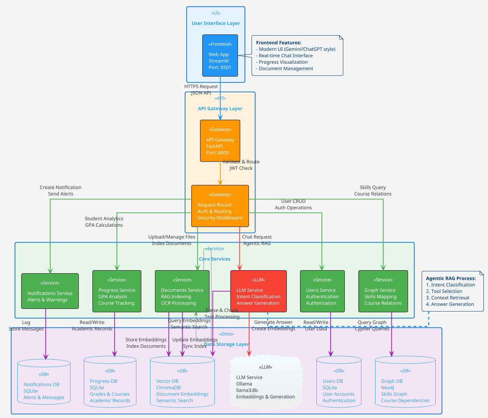
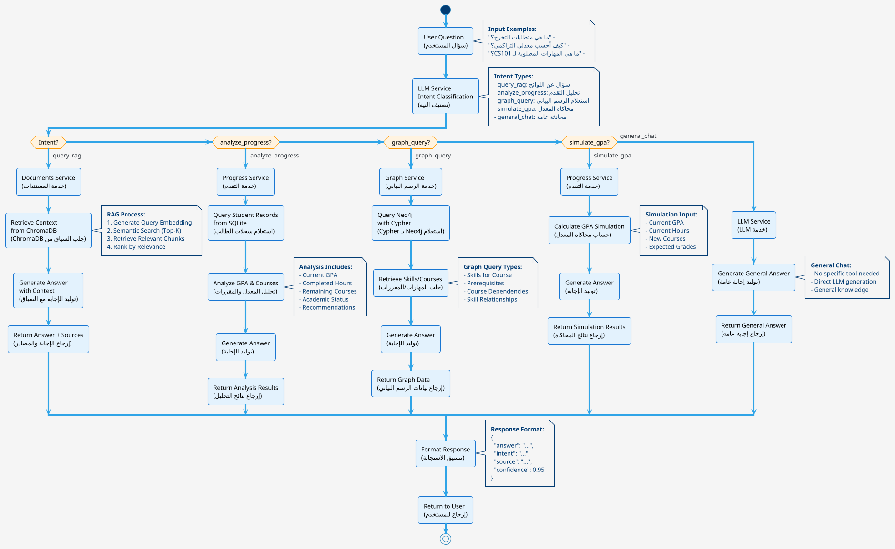
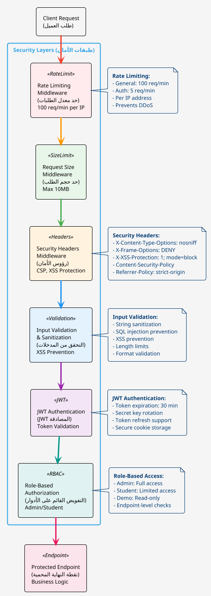

# منهجية التصميم - المرشد الأكاديمي الذكي
# Design Methodology - Smart Academic Advisor

## 📐 نظرة عامة على المنهجية / Methodology Overview

هذا المستند يشرح المنهجية التصميمية الكاملة المستخدمة في تطوير نظام المرشد الأكاديمي الذكي، بما في ذلك القرارات التصميمية، المبادئ المعمارية، وأدوات التصميم المستخدمة.

This document explains the complete design methodology used in developing the Smart Academic Advisor system, including design decisions, architectural principles, and design tools used.

---

## 🎯 المبادئ التصميمية / Design Principles

### 1. بنية الخدمات المصغرة (Microservices Architecture)
**السبب / Rationale:**
- فصل الاهتمامات (Separation of Concerns): كل خدمة مسؤولة عن وظيفة محددة
- قابلية التوسع (Scalability): يمكن توسيع كل خدمة بشكل مستقل
- المرونة (Flexibility): سهولة استبدال أو تحديث خدمة دون التأثير على الأخرى
- الصيانة (Maintainability): سهولة الصيانة والتطوير

**التطبيق / Implementation:**
- **Users Service:** إدارة المستخدمين والمصادقة
- **Progress Service:** تحليل التقدم الأكاديمي
- **Documents Service:** معالجة وفهرسة المستندات
- **Notifications Service:** إدارة الإشعارات
- **Graph Service:** إدارة قاعدة بيانات الرسم البياني
- **LLM Service:** معالجة الطلبات اللغوية

### 2. Agentic RAG (Retrieval Augmented Generation)
**السبب / Rationale:**
- تحسين دقة الإجابات من خلال استخدام سياق من المستندات
- توجيه ذكي للأسئلة إلى الأداة المناسبة
- تقليل الهلوسة (Hallucination) من خلال ربط الإجابات بالمصادر

**التطبيق / Implementation:**
1. **Intent Classification:** تحديد نية المستخدم باستخدام LLM
2. **Tool Selection:** اختيار الأداة المناسبة (RAG, Progress Analysis, Graph Query)
3. **Context Retrieval:** جلب السياق المناسب من المصادر
4. **Answer Generation:** توليد الإجابة بناءً على السياق

### 3. الأمان أولاً (Security First)
**السبب / Rationale:**
- حماية بيانات المستخدمين الحساسة
- منع الهجمات الشائعة (OWASP Top 10)
- الامتثال لأفضل الممارسات الأمنية

**التطبيق / Implementation:**
- JWT Authentication
- Role-Based Authorization
- Rate Limiting
- Input Validation & Sanitization
- Security Headers
- SQL Injection Prevention

### 4. التكوين الديناميكي (Dynamic Configuration)
**السبب / Rationale:**
- سهولة التعديل دون إعادة تشغيل النظام
- دعم بيئات متعددة (Development, Production)
- مرونة في التخصيص

**التطبيق / Implementation:**
- ملف `config/settings.json` مركزي
- Environment Variables
- Runtime Configuration Updates

---

## 🏗️ البنية المعمارية / System Architecture

### 1. طبقات النظام / System Layers

```
┌─────────────────────────────────────────────────────────┐
│                    Presentation Layer                     │
│              (Streamlit Frontend / UI)                    │
└──────────────────────┬──────────────────────────────────┘
                        │
┌──────────────────────▼──────────────────────────────────┐
│                   API Gateway Layer                       │
│         (FastAPI - Request Router & Auth)                │
└──────────────────────┬──────────────────────────────────┘
                        │
        ┌───────────────┼───────────────┐
        │               │               │
┌───────▼──────┐ ┌──────▼──────┐ ┌──────▼──────┐
│ Core Services│ │  LLM Service│ │ Graph Service│
│              │ │              │ │              │
│ - Users      │ │ - RAG        │ │ - Neo4j      │
│ - Progress   │ │ - Intent     │ │ - Skills     │
│ - Documents  │ │ - Generation │ │ - Courses   │
│ - Notifications│              │ │              │
└───────┬──────┘ └──────┬──────┘ └──────┬──────┘
        │               │               │
        └───────────────┼───────────────┘
                        │
┌───────────────────────▼──────────────────────────────────┐
│                    Data Layer                             │
│  ┌──────────┐  ┌──────────┐  ┌──────────┐  ┌──────────┐ │
│  │ SQLite   │  │ ChromaDB │  │  Neo4j   │  │  Ollama  │ │
│  │ (Users,  │  │ (Vector  │  │ (Graph)  │  │  (LLM)   │ │
│  │ Progress)│  │  Store)  │  │          │  │          │ │
│  └──────────┘  └──────────┘  └──────────┘  └──────────┘ │
└───────────────────────────────────────────────────────────┘
```

### 2. تدفق البيانات / Data Flow

#### تدفق طلب الدردشة / Chat Request Flow

```
User → Frontend → API Gateway → LLM Service
                                      │
                                      ├─→ Intent Classification
                                      │
                                      ├─→ Tool Selection
                                      │
                                      ├─→ Documents Service → ChromaDB (RAG)
                                      ├─→ Progress Service → SQLite (Analysis)
                                      └─→ Graph Service → Neo4j (Skills)
                                      │
                                      └─→ Answer Generation → User
```

#### تدفق فهرسة المستندات / Document Indexing Flow

```
Admin → Frontend → API Gateway → Documents Service
                                        │
                                        ├─→ Load Documents (PDF, DOCX, Images)
                                        ├─→ OCR Processing (for images)
                                        ├─→ Text Extraction
                                        ├─→ Chunking (Parent-Child Split)
                                        ├─→ Embedding Generation (Ollama)
                                        └─→ Storage (ChromaDB)
```

---

## 🔧 أدوات التصميم / Design Tools

### 1. PlantUML Diagrams

#### مخطط البنية المعمارية الكاملة / Complete Architecture Diagram



#### مخطط تدفق Agentic RAG / Agentic RAG Flow Diagram



#### مخطط الأمان / Security Architecture Diagram



### 2. Draw.io XML Code

#### البنية المعمارية الكاملة / Complete Architecture (Draw.io)

```xml
<mxfile host="app.diagrams.net">
  <diagram name="Complete Architecture" id="architecture">
    <mxGraphModel dx="1422" dy="794" grid="1" gridSize="10" guides="1" tooltips="1" connect="1" arrows="1" fold="1" page="1" pageScale="1" pageWidth="1169" pageHeight="1654" math="0" shadow="0">
      <root>
        <mxCell id="0" />
        <mxCell id="1" parent="0" />
        
        <!-- User Layer -->
        <mxCell id="user" value="User&#xa;(Student/Admin)" style="shape=umlActor;verticalLabelPosition=bottom;verticalAlign=top;html=1;outlineConnect=0;" vertex="1" parent="1">
          <mxGeometry x="80" y="40" width="30" height="60" as="geometry" />
        </mxCell>
        
        <!-- Frontend -->
        <mxCell id="frontend" value="Web App&#xa;(Streamlit)&#xa;Port: 8501" style="rounded=1;whiteSpace=wrap;html=1;fillColor=#dae8fc;strokeColor=#6c8ebf;" vertex="1" parent="1">
          <mxGeometry x="40" y="140" width="120" height="60" as="geometry" />
        </mxCell>
        
        <!-- API Gateway -->
        <mxCell id="gateway" value="API Gateway&#xa;(FastAPI)&#xa;Port: 8000" style="rounded=1;whiteSpace=wrap;html=1;fillColor=#fff2cc;strokeColor=#d6b656;" vertex="1" parent="1">
          <mxGeometry x="240" y="140" width="120" height="60" as="geometry" />
        </mxCell>
        
        <!-- Request Router -->
        <mxCell id="router" value="Request Router&#xa;(Auth Check, Routing)" style="rounded=1;whiteSpace=wrap;html=1;fillColor=#f8cecc;strokeColor=#b85450;" vertex="1" parent="1">
          <mxGeometry x="240" y="240" width="120" height="60" as="geometry" />
        </mxCell>
        
        <!-- Core Services Container -->
        <mxCell id="coreServices" value="Core Services" style="swimlane;whiteSpace=wrap;html=1;fillColor=#e1d5e7;strokeColor=#9673a6;" vertex="1" parent="1">
          <mxGeometry x="420" y="40" width="600" height="400" as="geometry" />
        </mxCell>
        
        <!-- Users Service -->
        <mxCell id="users" value="Users Service&#xa;(Accounts, Plans)" style="rounded=1;whiteSpace=wrap;html=1;fillColor=#fff2cc;strokeColor=#d6b656;" vertex="1" parent="coreServices">
          <mxGeometry x="20" y="40" width="120" height="60" as="geometry" />
        </mxCell>
        
        <!-- Progress Service -->
        <mxCell id="progress" value="Progress Service&#xa;(GPA, What-if)" style="rounded=1;whiteSpace=wrap;html=1;fillColor=#d5e8d4;strokeColor=#82b366;" vertex="1" parent="coreServices">
          <mxGeometry x="160" y="40" width="120" height="60" as="geometry" />
        </mxCell>
        
        <!-- Documents Service -->
        <mxCell id="documents" value="Documents Service&#xa;(Ingest, Parse, Chunk)" style="rounded=1;whiteSpace=wrap;html=1;fillColor=#d5e8d4;strokeColor=#82b366;" vertex="1" parent="coreServices">
          <mxGeometry x="300" y="40" width="120" height="60" as="geometry" />
        </mxCell>
        
        <!-- Notifications Service -->
        <mxCell id="notifications" value="Notifications Service&#xa;(Email, Push, In-App)" style="rounded=1;whiteSpace=wrap;html=1;fillColor=#ffe6cc;strokeColor=#d79b00;" vertex="1" parent="coreServices">
          <mxGeometry x="440" y="40" width="120" height="60" as="geometry" />
        </mxCell>
        
        <!-- Retrieval Service -->
        <mxCell id="retrieval" value="Retrieval Service&#xa;(RAG Retrieval)" style="rounded=1;whiteSpace=wrap;html=1;fillColor=#f8cecc;strokeColor=#b85450;" vertex="1" parent="coreServices">
          <mxGeometry x="20" y="140" width="120" height="60" as="geometry" />
        </mxCell>
        
        <!-- LLM Service -->
        <mxCell id="llm" value="LLM Service&#xa;(Answer Generation)" style="rounded=1;whiteSpace=wrap;html=1;fillColor=#e1d5e7;strokeColor=#9673a6;" vertex="1" parent="coreServices">
          <mxGeometry x="160" y="140" width="120" height="60" as="geometry" />
        </mxCell>
        
        <!-- Graph Service -->
        <mxCell id="graph" value="Graph Service&#xa;(Skills, Courses)" style="rounded=1;whiteSpace=wrap;html=1;fillColor=#d5e8d4;strokeColor=#82b366;" vertex="1" parent="coreServices">
          <mxGeometry x="300" y="140" width="120" height="60" as="geometry" />
        </mxCell>
        
        <!-- Databases -->
        <mxCell id="usersDB" value="Users DB&#xa;SQLite" style="shape=cylinder3;whiteSpace=wrap;html=1;boundedLbl=1;backgroundOutline=1;size=15;fillColor=#f5f5f5;strokeColor=#666666;" vertex="1" parent="1">
          <mxGeometry x="480" y="500" width="80" height="100" as="geometry" />
        </mxCell>
        
        <mxCell id="progressDB" value="Progress DB&#xa;SQLite" style="shape=cylinder3;whiteSpace=wrap;html=1;boundedLbl=1;backgroundOutline=1;size=15;fillColor=#f5f5f5;strokeColor=#666666;" vertex="1" parent="1">
          <mxGeometry x="600" y="500" width="80" height="100" as="geometry" />
        </mxCell>
        
        <mxCell id="vectorDB" value="Vector DB&#xa;ChromaDB&#xa;Port: 8001" style="shape=cylinder3;whiteSpace=wrap;html=1;boundedLbl=1;backgroundOutline=1;size=15;fillColor=#f5f5f5;strokeColor=#666666;" vertex="1" parent="1">
          <mxGeometry x="720" y="500" width="80" height="100" as="geometry" />
        </mxCell>
        
        <mxCell id="graphDB" value="Graph DB&#xa;Neo4j&#xa;Port: 7474" style="shape=cylinder3;whiteSpace=wrap;html=1;boundedLbl=1;backgroundOutline=1;size=15;fillColor=#f5f5f5;strokeColor=#666666;" vertex="1" parent="1">
          <mxGeometry x="840" y="500" width="80" height="100" as="geometry" />
        </mxCell>
        
        <mxCell id="ollama" value="LLM Service&#xa;Ollama&#xa;Port: 11434" style="shape=cloud;whiteSpace=wrap;html=1;fillColor=#e1d5e7;strokeColor=#9673a6;" vertex="1" parent="1">
          <mxGeometry x="960" y="500" width="100" height="70" as="geometry" />
        </mxCell>
        
        <!-- Connections -->
        <mxCell id="edge1" value="" style="endArrow=classic;html=1;rounded=0;" edge="1" parent="1" source="user" target="frontend">
          <mxGeometry width="50" height="50" relative="1" as="geometry">
            <mxPoint x="400" y="300" as="sourcePoint" />
            <mxPoint x="450" y="250" as="targetPoint" />
          </mxGeometry>
        </mxCell>
        
        <mxCell id="edge2" value="HTTPS" style="endArrow=classic;html=1;rounded=0;" edge="1" parent="1" source="frontend" target="gateway">
          <mxGeometry width="50" height="50" relative="1" as="geometry">
            <mxPoint x="400" y="300" as="sourcePoint" />
            <mxPoint x="450" y="250" as="targetPoint" />
          </mxGeometry>
        </mxCell>
        
        <mxCell id="edge3" value="" style="endArrow=classic;html=1;rounded=0;" edge="1" parent="1" source="gateway" target="router">
          <mxGeometry width="50" height="50" relative="1" as="geometry">
            <mxPoint x="400" y="300" as="sourcePoint" />
            <mxPoint x="450" y="250" as="targetPoint" />
          </mxGeometry>
        </mxCell>
        
        <mxCell id="edge4" value="Route" style="endArrow=classic;html=1;rounded=0;" edge="1" parent="1" source="router" target="users">
          <mxGeometry width="50" height="50" relative="1" as="geometry">
            <mxPoint x="400" y="300" as="sourcePoint" />
            <mxPoint x="450" y="250" as="targetPoint" />
          </mxGeometry>
        </mxCell>
        
        <mxCell id="edge5" value="" style="endArrow=classic;html=1;rounded=0;" edge="1" parent="1" source="users" target="usersDB">
          <mxGeometry width="50" height="50" relative="1" as="geometry">
            <mxPoint x="400" y="300" as="sourcePoint" />
            <mxPoint x="450" y="250" as="targetPoint" />
          </mxGeometry>
        </mxCell>
        
        <mxCell id="edge6" value="" style="endArrow=classic;html=1;rounded=0;" edge="1" parent="1" source="progress" target="progressDB">
          <mxGeometry width="50" height="50" relative="1" as="geometry">
            <mxPoint x="400" y="300" as="sourcePoint" />
            <mxPoint x="450" y="250" as="targetPoint" />
          </mxGeometry>
        </mxCell>
        
        <mxCell id="edge7" value="" style="endArrow=classic;html=1;rounded=0;" edge="1" parent="1" source="retrieval" target="vectorDB">
          <mxGeometry width="50" height="50" relative="1" as="geometry">
            <mxPoint x="400" y="300" as="sourcePoint" />
            <mxPoint x="450" y="250" as="targetPoint" />
          </mxGeometry>
        </mxCell>
        
        <mxCell id="edge8" value="" style="endArrow=classic;html=1;rounded=0;" edge="1" parent="1" source="llm" target="ollama">
          <mxGeometry width="50" height="50" relative="1" as="geometry">
            <mxPoint x="400" y="300" as="sourcePoint" />
            <mxPoint x="450" y="250" as="targetPoint" />
          </mxGeometry>
        </mxCell>
        
        <mxCell id="edge9" value="" style="endArrow=classic;html=1;rounded=0;" edge="1" parent="1" source="graph" target="graphDB">
          <mxGeometry width="50" height="50" relative="1" as="geometry">
            <mxPoint x="400" y="300" as="sourcePoint" />
            <mxPoint x="450" y="250" as="targetPoint" />
          </mxGeometry>
        </mxCell>
        
      </root>
    </mxGraphModel>
  </diagram>
</mxfile>
```

---

## 📊 قرارات التصميم الرئيسية / Key Design Decisions

### 1. اختيار FastAPI كـ API Gateway
**السبب:**
- أداء عالي (High Performance)
- دعم تلقائي لـ OpenAPI/Swagger
- Type hints و validation مدمج
- سهولة التطوير والصيانة

### 2. اختيار Streamlit كـ Frontend
**السبب:**
- تطوير سريع للواجهات
- دعم Python الكامل
- سهولة التكامل مع FastAPI
- مناسب للنماذج الأولية والتطبيقات الداخلية

### 3. استخدام SQLite لقواعد البيانات العلائقية
**السبب:**
- بساطة في الإعداد
- لا يحتاج خادم منفصل
- مناسب للتطبيقات الصغيرة والمتوسطة
- سهولة النسخ الاحتياطي

**ملاحظة:** للإنتاج، يُنصح باستخدام PostgreSQL.

### 4. استخدام ChromaDB كـ Vector Store
**السبب:**
- مفتوح المصدر
- سهل الإعداد والاستخدام
- دعم ممتاز من LangChain
- مناسب للمشاريع الصغيرة والمتوسطة

### 5. استخدام Neo4j لقاعدة بيانات الرسم البياني
**السبب:**
- متخصص في البيانات العلائقية
- استعلامات قوية للرسم البياني
- مناسب لتمثيل العلاقات بين المقررات والمهارات
- دعم ممتاز للـ Cypher queries

### 6. استخدام Ollama كـ LLM Service
**السبب:**
- تشغيل محلي (Privacy)
- مفتوح المصدر
- دعم نماذج متعددة
- سهولة التكامل

---

## 🔄 أنماط التصميم المستخدمة / Design Patterns Used

### 1. Repository Pattern
**التطبيق:** في `database.py` - فصل منطق الوصول إلى البيانات

### 2. Service Layer Pattern
**التطبيق:** كل خدمة في مجلد `services/` - فصل منطق العمل

### 3. Dependency Injection
**التطبيق:** في FastAPI باستخدام `Depends()` - حقن الاعتمادات

### 4. Middleware Pattern
**التطبيق:** في `security_middleware.py` - معالجة الطلبات قبل الوصول إلى المسارات

### 5. Strategy Pattern
**التطبيق:** في `llm_service.py` - اختيار استراتيجية مختلفة حسب النية (Intent)

---

## 📈 مقاييس الأداء / Performance Metrics

### الاستجابة المتوقعة / Expected Response Times
- **API Gateway:** < 50ms
- **Authentication:** < 100ms
- **RAG Query:** 2-5 seconds (depending on LLM)
- **Progress Analysis:** < 500ms
- **Document Indexing:** 1-5 minutes (depending on file size)

### قابلية التوسع / Scalability
- **Horizontal Scaling:** يمكن إضافة مثيلات إضافية من الخدمات
- **Vertical Scaling:** يمكن زيادة موارد الحاويات
- **Database Scaling:** يمكن الانتقال إلى PostgreSQL/MySQL للإنتاج

---

## 🔐 اعتبارات الأمان / Security Considerations

### 1. Authentication & Authorization
- JWT tokens مع انتهاء صلاحية
- Role-based access control (RBAC)
- Password hashing باستخدام bcrypt

### 2. Input Validation
- Pydantic models للتحقق من المدخلات
- Sanitization للسلاسل النصية
- SQL injection prevention

### 3. Rate Limiting
- 100 requests per minute للطلبات العامة
- 10 requests per minute لمسارات المصادقة

### 4. Security Headers
- X-Content-Type-Options: nosniff
- X-Frame-Options: DENY
- X-XSS-Protection: 1; mode=block
- Strict-Transport-Security

---

## 🚀 التطوير المستقبلي / Future Development

### تحسينات مقترحة / Proposed Improvements
1. **Migration to PostgreSQL:** لقواعد البيانات العلائقية
2. **Redis Caching:** لتحسين الأداء
3. **Message Queue (RabbitMQ/Kafka):** للمعالجة غير المتزامنة
4. **Monitoring & Logging:** Elasticsearch + Kibana
5. **CI/CD Pipeline:** GitHub Actions أو GitLab CI
6. **Kubernetes Deployment:** للتوسع الأفضل
7. **GraphQL API:** بدلاً من REST API
8. **WebSocket Support:** للدردشة في الوقت الفعلي

---

## 📚 المراجع / References

- [FastAPI Documentation](https://fastapi.tiangolo.com/)
- [Streamlit Documentation](https://docs.streamlit.io/)
- [LangChain Documentation](https://python.langchain.com/)
- [OWASP Top 10](https://owasp.org/www-project-top-ten/)
- [Microservices Patterns](https://microservices.io/patterns/)
- [RAG Architecture](https://www.pinecone.io/learn/retrieval-augmented-generation/)

---

**آخر تحديث / Last Updated:** 2025  
**الإصدار / Version:** 1.0.0

